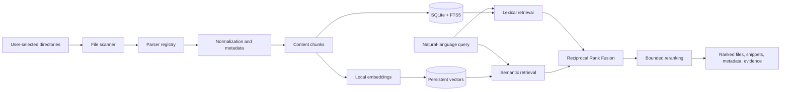

# LocalAI Search

<div align="center">

**Search your entire computer by meaning, not just filenames.**

Local-first semantic and lexical retrieval for code, notebooks, notes, and technical documents.

<br />


</div>

<br />

## The problem

Filename search answers **“what is this file called?”** LocalAI Search is built to answer **“where did I work on this idea?”**

```text
Where did I debug the PyTorch tensor shape error?
```

The relevant file might not contain that exact sentence. It may contain:

```text
RuntimeError: mat1 and mat2 shapes cannot be multiplied
```

LocalAI Search combines exact retrieval for technical identifiers with semantic retrieval for concepts and paraphrases. The result is a real search pipeline, not a chatbot over documents.

## What makes it different

| Search capability | What it handles well |
| --- | --- |
| **Lexical retrieval** | Function names, imports, error messages, symbols, and rare technical terms |
| **Semantic retrieval** | Natural-language questions, concepts, and paraphrased descriptions |
| **Hybrid ranking** | Reciprocal Rank Fusion across independent retrieval systems |
| **Evidence-based results** | Real snippets, file metadata, and grounded match reasons |
| **Incremental indexing** | New, modified, unchanged, and deleted files without a full rebuild |
| **Local inference** | No paid API or hosted search service required for the core system |

## Architecture



### Indexing pipeline

```text
Filesystem
  -> discovery
  -> parsing
  -> normalization
  -> metadata extraction
  -> chunking
  -> SQLite / FTS5 / local vectors
```

### Retrieval pipeline

```text
Query
  -> lexical candidates
  -> semantic candidates
  -> Reciprocal Rank Fusion
  -> bounded reranking
  -> deduplicated, evidence-backed results
```

Reciprocal Rank Fusion is used because BM25-style scores and embedding similarities are not naturally comparable. Rank-based fusion avoids pretending that they share a common numeric scale.

## Engineering highlights

### Local-first by design

Core indexing and retrieval run on the user's machine. The architecture does not require OpenAI, Anthropic, Pinecone, Qdrant Cloud, or any paid service.

### Incremental indexing

Each indexed file records its path, size, modification time, and SHA-256 content hash. Subsequent indexing runs can skip unchanged files, reprocess changed files, and remove deleted files from the local index.

### Structure-aware parsing

Python files are parsed with the AST to extract functions, classes, and imports. Jupyter notebooks preserve cell boundaries so the search system can retain useful context instead of indexing raw notebook JSON.

### Grounded result explanations

Search explanations are derived from retrieval evidence such as matched terms, file type, language, and indexed snippets. The system does not invent excerpts from documents.

### Laptop-sized architecture

SQLite provides durable metadata and FTS5 lexical retrieval. Local serialized vectors keep the MVP portable and avoid introducing a database server before the corpus size justifies one.

## Current implementation

### Shipped

- recursive file discovery with configurable extensions and ignored directories
- symlink, hidden-file, permission, and file-size handling
- parsers for Python, Jupyter notebooks, Markdown, text, JSON, and CSV
- Python AST extraction for functions, classes, and imports
- SQLite file and chunk persistence
- SHA-256 hashing and incremental new/updated/deleted detection
- SQLite FTS5 lexical retrieval with type and path filters
- local Sentence Transformers embeddings
- persistent chunk-vector storage
- semantic retrieval with filters
- Reciprocal Rank Fusion of lexical and semantic results
- bounded reranking with deterministic fallback behavior
- grounded `why_matched` evidence
- behavioral tests across scanning, parsing, indexing, and retrieval

### In progress

- full PDF text extraction with page metadata
- file-aware chunking for notebook cells, Python symbols, Markdown headings, and PDF pages
- embedding cache invalidation and batch generation
- browser interface
- filesystem watching
- reproducible retrieval benchmark and failure analysis suite

The distinction is intentional: this repository documents what is implemented today and what is being built next.

## Local API

The FastAPI service exposes the current retrieval pipeline on localhost:

```bash
uvicorn localsearch.api.app:app --host 127.0.0.1 --port 8000
```

Available endpoints:

| Method | Endpoint | Purpose |
| --- | --- | --- |
| `GET` | `/health` | Verify the local service is available |
| `GET` | `/stats` | Return indexed file and chunk counts |
| `POST` | `/search` | Run lexical, semantic, or hybrid retrieval |
| `POST` | `/index` | Incrementally index selected directories |
| `GET` | `/files/{id}` | Inspect indexed file metadata and chunks |

Example request:

```bash
curl -X POST http://127.0.0.1:8000/search \
  -H 'Content-Type: application/json' \
  -d '{"query":"tensor shape error","mode":"hybrid","limit":10}'
```

The service is intended for local use and binds to loopback by default in documented examples.

## Supported formats

| Extension | Handling |
| --- | --- |
| `.py` | Text plus AST-derived symbols and imports |
| `.ipynb` | Markdown and code cells with boundaries preserved |
| `.md` | Markdown text |
| `.txt` | UTF-8 text with replacement for invalid bytes |
| `.json` | Parsed and normalized JSON |
| `.csv` | Searchable tabular text |
| `.pdf` | Parser boundary present; extraction is next |
| `.yaml`, `.yml`, `.html`, `.xml` | Scanner support; specialized parsing planned |

## Quick start

### Requirements

- Python 3.11 or newer
- macOS or Linux
- local storage for the embedding model and index

### Install

```bash
git clone https://github.com/coder-raj369/AI-Search.git
cd AI-Search

python3 -m venv .venv
source .venv/bin/activate
pip install -e .
```

The first semantic search may download the configured embedding model. Inference remains local after installation.

### Scan and index a directory

```bash
localsearch init
localsearch index ~/Documents
```

### CLI commands

```bash
localsearch search "tensor shape error"
localsearch search "pytorch" --type ipynb
localsearch search "training pipeline" --path ~/Documents/projects
localsearch stats
```

The scanner and indexing commands are wired into the current CLI. Lexical, semantic, hybrid, and reranking implementations are available as Python modules while the complete retrieval workflow is being connected to the CLI and upcoming local API.

## Result contract

The intended result shape is evidence-first:

```json
{
  "filename": "debug_model.py",
  "path": "/Users/example/Documents/debug_model.py",
  "extension": ".py",
  "score": 0.91,
  "snippet": "RuntimeError: mat1 and mat2 shapes cannot be multiplied",
  "why_matched": [
    "Exact terms: shape, tensor",
    "File type: .py",
    "Language: python"
  ]
}
```

Snippets are taken from indexed content. They are not generated summaries presented as source text.

## Technology choices

| Layer | Choice | Why |
| --- | --- | --- |
| Runtime | Python 3.11+ | Parsing, ML, CLI, and testing ecosystem |
| Metadata | SQLite | Embedded, durable, inspectable, zero-operations |
| Lexical search | SQLite FTS5 | Fast local full-text retrieval without another service |
| Embeddings | Sentence Transformers | Open-source local inference |
| Vector persistence | SQLite-backed serialized vectors | Portable MVP with low operational complexity |
| Rank fusion | Reciprocal Rank Fusion | Robust across incomparable score spaces |
| Tests | pytest | Real behavioral coverage for the search path |

## Repository structure

```text
AI-Search/
├── src/localsearch/
│   ├── cli.py
│   ├── config.py
│   ├── database/
│   ├── embeddings/
│   ├── indexing/
│   ├── parsers/
│   ├── retrieval/
│   └── scanner/
├── tests/
├── benchmarks/
├── pyproject.toml
├── README.md
└── .gitignore
```

## Privacy and security

- user-selected local roots only
- no hosted API required for core search
- no file-content telemetry
- hidden and ignored directories excluded by default
- symlinks not followed by default
- configurable maximum file size
- parser failures isolated to individual files
- future API intended to bind to localhost by default

Users should index only directories they explicitly intend to search.

## Evaluation plan

Search quality will be measured rather than described with unsupported claims. The evaluation suite will compare:

1. lexical retrieval
2. semantic retrieval
3. hybrid retrieval
4. hybrid retrieval with reranking

Metrics:

- Precision@K
- Recall@K
- Mean Reciprocal Rank
- nDCG
- query latency
- indexing throughput
- incremental update time

The benchmark will use reproducible queries and relevance judgments so retrieval changes can be compared over time.

## Development

Run the full test suite:

```bash
.venv/bin/python -m pytest -q
```

Run a focused retrieval test:

```bash
.venv/bin/python -m pytest tests/test_hybrid_search.py -q
```

Tests exercise real files and retrieval behavior instead of mocking away the core indexing and ranking path.

## Roadmap

- [ ] Complete PDF extraction with page-level metadata
- [ ] Add file-aware chunking
- [ ] Improve embedding cache invalidation and batching
- [ ] Connect hybrid retrieval to the CLI
- [ ] Add FastAPI localhost service
- [ ] Add browser search interface
- [ ] Add filesystem watcher
- [ ] Add labeled evaluation corpus and benchmark reports
- [ ] Add CI, type checking, and production hardening

## Why this is a strong portfolio project

LocalAI Search demonstrates applied search engineering across the full path from filesystem to ranked result:

- information retrieval and rank fusion
- local embedding inference
- incremental indexing and content identity
- structure-aware code and notebook parsing
- privacy-preserving architecture
- evidence-backed result explanations
- behavioral testing and measurable evaluation

The goal is not to maximize feature count. The goal is to build a search system whose quality, latency, and failure modes can be measured and improved.

## License

License details will be added before the first public release.

## Repository

https://github.com/coder-raj369/AI-Search
