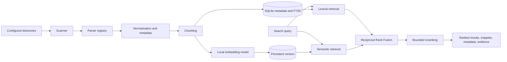
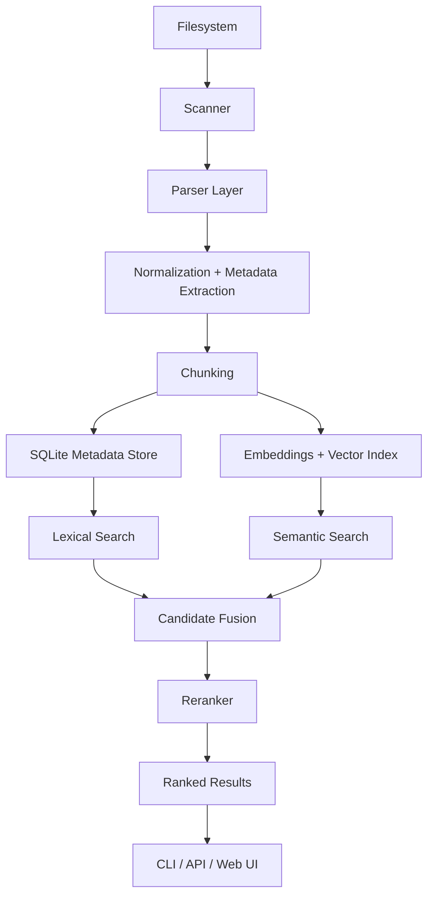

# LocalAI Search

> Search your computer by meaning, not just by filenames.

LocalAI Search is a local-first search engine for code, notebooks, notes, and technical documents. It combines lexical retrieval, semantic embeddings, reciprocal rank fusion, and evidence-based reranking so natural-language queries can find relevant files even when the exact wording is different.

The core principle is simple: **search results are the product**. This is not a chatbot wrapped around a vector database. It is an indexing and retrieval system designed to run on a developer's machine, with files remaining local by default.

## Why LocalAI Search?

Traditional file search is excellent at exact names and exact strings, but weak at questions such as:

```text
Where did I debug the PyTorch tensor shape error?
```

LocalAI Search is designed to retrieve the notebook, script, or note containing the relevant evidence, even if it uses wording such as:

```text
RuntimeError: mat1 and mat2 shapes cannot be multiplied
```

It combines complementary retrieval strategies:

| Capability | Strength |
| --- | --- |
| Lexical retrieval | Exact identifiers, function names, imports, error messages, and rare technical terms |
| Semantic retrieval | Concepts, paraphrases, and natural-language descriptions |
| Hybrid fusion | Robust candidate ranking across lexical and semantic signals |
| Reranking | Better ordering of the highest-value candidates |
| Evidence | Grounded explanations based on actual matched terms and metadata |
| Incremental indexing | Reprocess only new or changed files |

## Project status

The repository is an actively developed MVP. The implemented foundation currently includes:

- recursive local file discovery with ignore rules and size limits
- parsing for Python, Jupyter notebooks, Markdown, text, JSON, CSV, and PDF placeholder handling
- Python AST metadata extraction for functions, classes, and imports
- SQLite persistence for file and chunk metadata
- SHA-256 content hashing and incremental new/updated/deleted detection
- SQLite FTS5 lexical retrieval with file-type and path filters
- local sentence-transformers embeddings with persistent chunk vectors
- semantic retrieval with local inference
- Reciprocal Rank Fusion of lexical and semantic result lists
- bounded reranking with deterministic fallback behavior
- grounded `why_matched` result evidence
- automated tests covering the implemented slices

The API, browser interface, filesystem watcher, benchmark suite, and production hardening remain planned work. The README intentionally distinguishes shipped functionality from the roadmap.

## Architecture



### Indexing flow

1. Scan user-selected roots recursively.
2. Ignore unsupported, hidden, oversized, or excluded files according to configuration.
3. Parse each supported file through the parser registry.
4. Normalize content and extract file-specific metadata.
5. Store files and chunks in SQLite.
6. Update the FTS5 lexical index.
7. Generate and persist local embeddings for searchable chunks.
8. On later runs, compare size and content hash to skip unchanged files.

### Search flow

1. Run lexical retrieval for exact and technical matches.
2. Run semantic retrieval using a local embedding model.
3. Fuse ranked lists with Reciprocal Rank Fusion rather than averaging incomparable scores.
4. Rerank only a bounded candidate set.
5. Return file-level results with snippets, metadata, and grounded evidence.

## Technology decisions

| Area | Decision | Rationale |
| --- | --- | --- |
| Runtime | Python 3.11+ | Strong local parsing, ML, CLI, and testing ecosystem |
| Metadata store | SQLite | Embedded, durable, inspectable, and zero-operations |
| Lexical retrieval | SQLite FTS5 | Local full-text search without another service |
| Embeddings | Sentence Transformers | Open-source local inference with a practical laptop footprint |
| Vector persistence | SQLite-backed serialized vectors | Keeps the MVP simple and portable while the corpus is small |
| Rank fusion | Reciprocal Rank Fusion | Does not assume lexical and semantic scores share a scale |
| Testing | pytest | Focused behavioral tests for indexing and retrieval |
| Packaging | `pyproject.toml` | Standard editable installation and CLI entry point |

The architecture deliberately avoids cloud APIs, hosted vector databases, distributed services, and unnecessary infrastructure for the local MVP.

## Supported formats

| Format | Current handling |
| --- | --- |
| `.py` | Text plus AST-derived functions, classes, and imports |
| `.ipynb` | Cell-aware extraction of Markdown and code |
| `.md` | Markdown text preserved for search |
| `.txt` | UTF-8 text with replacement for invalid bytes |
| `.json` | Parsed and normalized JSON |
| `.csv` | Textual tabular content |
| `.pdf` | Parser boundary exists; full local text extraction is planned |
| `.yaml`, `.yml`, `.html`, `.xml` | Scanner support; specialized parsing is planned |

## Quick start

### Requirements

- Python 3.11 or newer
- macOS or Linux
- enough local storage for the embedding model and index

### Install

```bash
git clone https://github.com/coder-raj369/AI-Search.git
cd AI-Search

python3 -m venv .venv
source .venv/bin/activate
pip install -e .
```

The embedding dependency may download a model the first time semantic search is used. That model is used locally after installation; the core search flow does not require a paid API.

### Discover files

```bash
localsearch init
localsearch index ~/Documents
```

The scanner reports supported files discovered under the requested root. Indexing is incremental: unchanged files are skipped, modified files are reprocessed, and deleted files are removed from the local database.

### Use the CLI

```bash
localsearch search "tensor shape error"
localsearch search "pytorch" --type ipynb
localsearch search "training pipeline" --path ~/Documents/projects
localsearch stats
```

The scanner and indexing commands are the current CLI foundation. The lexical, semantic, hybrid, and reranking implementations are available as Python modules; wiring the complete retrieval pipeline into the CLI, API, and browser interface is planned next.

## Result model

Search results are designed to carry evidence rather than vague generated explanations:

```json
{
    "filename": "debug_model.py",
    "path": "/Users/example/Documents/debug_model.py",
    "extension": ".py",
    "score": 0.91,
    "snippet": "RuntimeError: mat1 and mat2 shapes cannot be multiplied",
    "why_matched": [
        "Exact terms: shape, tensor",
        "File type: .py",
        "Language: python"
    ]
}
```

Snippets come from indexed content. The system does not fabricate document excerpts.

## Repository layout

```text
AI-Search/
├── src/localsearch/
│   ├── cli.py
│   ├── config.py
│   ├── database/
│   │   └── connection.py
│   ├── embeddings/
│   │   ├── model.py
│   │   └── vector_store.py
│   ├── indexing/
│   │   ├── hashing.py
│   │   └── indexer.py
│   ├── parsers/
│   │   ├── base.py
│   │   ├── notebook.py
│   │   ├── python.py
│   │   └── registry.py
│   ├── retrieval/
│   │   ├── bm25.py
│   │   ├── hybrid.py
│   │   ├── reranker.py
│   │   └── semantic.py
│   └── scanner/
│       └── discovery.py
├── tests/
├── benchmarks/
├── pyproject.toml
├── README.md
└── .gitignore
```

## Privacy and security model

LocalAI Search is designed for personal files, so privacy is a product requirement rather than an afterthought:

- files are indexed from user-selected local roots
- core retrieval runs locally
- no file contents are sent to a hosted API
- no telemetry is required for search
- hidden and ignored directories are excluded by default
- symlinks are not followed by default
- oversized files are skipped according to configuration
- parser failures should be isolated to the affected file
- future API work should bind to localhost by default

Users should index only directories they explicitly intend to search.

## Quality strategy

Search quality will be evaluated empirically rather than described with unsupported claims. The planned benchmark compares:

- lexical retrieval
- semantic retrieval
- hybrid retrieval
- hybrid retrieval with reranking

Planned metrics include:

- Precision@K
- Recall@K
- Mean Reciprocal Rank
- nDCG
- query latency
- indexing throughput
- incremental update time

The benchmark dataset will contain reproducible queries and relevance judgments so ranking changes can be compared over time.

## Development

Run the complete test suite with:

```bash
.venv/bin/python -m pytest -q
```

Run a focused test slice with:

```bash
.venv/bin/python -m pytest tests/test_hybrid_search.py -q
```

The project uses small behavioral tests around scanners, parsers, indexing, lexical retrieval, semantic retrieval, hybrid fusion, and reranking. Tests should exercise real parsing and retrieval behavior rather than mock away the core search path.

## Roadmap

### Near term

- replace the PDF placeholder with PyMuPDF-based page extraction
- add file-aware chunking for notebook cells, Python symbols, Markdown headings, and PDF pages
- improve embedding cache invalidation and batch generation
- expose hybrid search through a FastAPI localhost service
- add a minimal browser UI with filters and file-open actions

### Search quality

- build a labeled evaluation corpus
- compare BM25, semantic, hybrid, and reranked retrieval
- add failure analysis and query-level diagnostics
- measure latency and memory usage on representative local corpora

### Reliability

- add filesystem watching with `watchdog`
- add doctor and rebuild commands
- harden malformed-file and permission-error handling
- add CI for linting, typing, tests, and package installation

## What this project demonstrates

LocalAI Search is intended to demonstrate practical search engineering, not just model integration:

- designing an end-to-end indexing pipeline
- combining information retrieval methods with different score spaces
- handling incremental state and content identity
- extracting structure from code and notebooks
- keeping inference and user data local
- testing ranking behavior with real files
- measuring quality and latency instead of relying on anecdotes

## License

License details will be added before the first public release.

## Repository

https://github.com/coder-raj369/AI-Search
# LocalAI Search

Search your computer by meaning, not just by filenames.

Local-first semantic + lexical search for code, notebooks, PDFs, Markdown, and documents.

## Overview

LocalAI Search is a privacy-first desktop search engine designed for developers and researchers who want to search their own files using natural language without sending data to third-party services. The system indexes local files, extracts meaningful content, combines lexical and semantic retrieval, and returns ranked results with snippets and metadata.

The project is intentionally built around a local-first architecture so it can run comfortably on a developer laptop while remaining fully under the user's control.

## Why this project matters

Traditional file search is limited to filename and exact text matching. LocalAI Search goes further by combining:

- lexical retrieval for technical identifiers and precise terms
- semantic retrieval for concept matching and paraphrasing
- hybrid fusion to unify multiple retrieval strategies
- metadata-aware indexing for better result relevance
- local-first execution to preserve privacy and avoid paid APIs

This makes the system useful for real-world developer workflows such as:

- finding the notebook where a model was trained
- locating code that implemented a custom optimization or debugging fix
- finding notes, PDFs, or markdown files related to a concept even when the wording differs
- searching previously encountered errors without remembering exact strings

## Core product principle

This is not a chatbot layered over a document dump. It is a real search engine.

The primary output is ranked search results with:

- file name
- file path
- relevance score
- matching snippet
- why it matched
- metadata such as type, modified time, and source context

## Architecture



### Retrieval pipeline

1. Discover supported files from configured directories
2. Parse supported document types
3. Normalize and extract metadata
4. Split content into meaningful chunks
5. Store metadata in SQLite
6. Build lexical index for keyword retrieval
7. Build semantic vector index for natural-language matching
8. Fuse lexical + semantic candidate sets
9. Rank and return relevant file and chunk results

## Supported file types

The initial scope prioritizes:

- Python (.py)
- Jupyter notebooks (.ipynb)
- Markdown (.md)
- text (.txt)
- PDF (.pdf)
- CSV (.csv)
- JSON (.json)
- YAML / YML (.yaml, .yml)
- HTML / XML (.html, .xml)

The MVP focuses on the most practical local developer formats first.

## Local-first design

The system is built to run entirely on the user's machine.

Key principles:

- no cloud dependency for indexing or search
- no paid embedding or reranking API required
- no external file upload requirement
- local persistence for metadata and search state
- privacy defaults enabled by default

## Current status

This repository is in active development and currently includes the foundational phases:

- Phase 0: architecture and technology evaluation
- Phase 1: scanner and configuration
- Phase 2: parser layer
- Phase 3: SQLite metadata + incremental indexing

The project is intentionally structured so each phase adds a production-grade building block without overengineering early.

## Tech stack

### Core

- Python 3.11+
- SQLite
- FastAPI (planned for API layer)
- React / Vite (planned for UI)

### Search and retrieval

- SQLite FTS for lexical retrieval
- FAISS for vector search
- SentenceTransformers for local embeddings
- hybrid rank fusion (RRF) for search quality

### Parsing

- standard library for text and JSON processing
- AST-based extraction for Python
- notebook parsing for Jupyter cells
- PDF extraction layer planned with local tools

## Installation

```bash
cd /Users/rajpandit/Documents/AI\ Search
python3 -m venv .venv
source .venv/bin/activate
pip install -e .
```

## CLI usage

```bash
localsearch init
localsearch index ~/Documents
localsearch search "tensor shape error"
localsearch search "pytorch" --type ipynb
localsearch stats
localsearch doctor
```

## Example search workflow

```bash
localsearch index ~/Documents
localsearch search "Where did I debug the PyTorch tensor shape error?"
```

Expected behavior:

- lexical matching for technical terms
- semantic matching for paraphrased queries
- relevant notebook and code files ranked higher
- snippets returned from actual file content

## Project structure

```text
localsearch/
├── src/
│   └── localsearch/
│       ├── cli.py
│       ├── config.py
│       ├── scanners/
│       ├── parsers/
│       ├── database/
│       ├── indexing/
│       └── retrieval/
├── tests/
├── docs/
├── benchmarks/
├── pyproject.toml
├── README.md
└── .gitignore
```

## Privacy and security

LocalAI Search is designed around a clear privacy model:

- files stay on the machine
- no cloud dependency for core retrieval
- local-only inference by default
- user-controlled indexing roots
- safe handling of symlinks, hidden directories, and malformed files

The system will keep privacy defaults explicit and conservative.

## Performance goals

The project targets a pragmatic local-first performance model:

- fast incremental reindexing for changed files
- no full reindex on every run
- metadata-driven update detection
- candidate filtering before expensive reranking
- retrieval benchmarks for quality and latency

## Roadmap

### Phase 1: scanner and config
- file discovery
- supported extensions
- ignore rules
- metadata collection

### Phase 2: parser layer
- Python, notebook, markdown, JSON, CSV, text parsing
- extraction of searchable content and metadata

### Phase 3: database and incremental indexing
- SQLite persistence
- hashing and change detection
- updated/new/deleted tracking

### Phase 4: lexical retrieval
- BM25 / FTS-based matching
- ranked keyword results
- filter support

### Phase 5: semantic retrieval
- local embeddings
- vector search index
- embedding cache

### Phase 6: hybrid search
- lexical + semantic fusion
- RRF-based rank combination
- result grouping by file

### Phase 7: reranking and API
- ranking improvements
- FastAPI endpoints
- browser UI

### Phase 8: evaluation and benchmarking
- query sets
- relevance judgments
- MRR / Recall@K / nDCG
- performance reports

## Why this is a strong portfolio project

This project combines multiple high-value engineering competencies:

- systems design for local search infrastructure
- file parsing and indexing architecture
- information retrieval and ranking
- local embedding workflows
- metadata-driven data engineering
- privacy-preserving product design
- benchmarking and evaluation discipline

It is not a toy demo; it is a practical local search system with engineering decisions grounded in retrieval quality and real-world developer workflows.

## License

This project currently uses the standard open-source project structure and is intended for portfolio and learning use unless otherwise specified.

## Contributing

Contributions are welcome for:

- parser improvements
- retrieval quality enhancements
- benchmark creation
- UI work
- robustness and security hardening

## Contact

For project updates and technical discussions, this repository is the source of truth.
