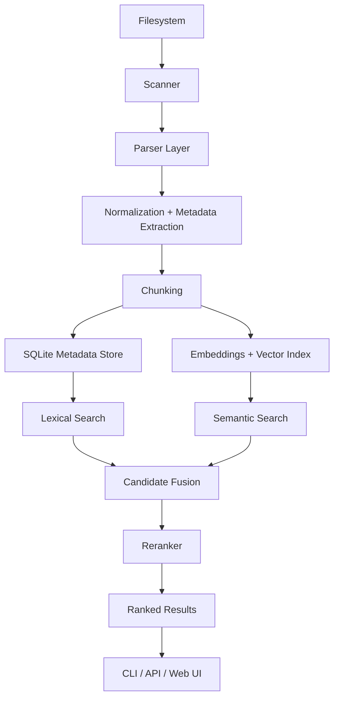

# LocalAI Search

Search your computer by meaning, not just by filenames.

Local-first semantic + lexical search for code, notebooks, PDFs, Markdown, and documents.

## Overview

LocalAI Search is a privacy-first desktop search engine designed for developers and researchers who want to search their own files using natural language without sending data to third-party services. The system indexes local files, extracts meaningful content, combines lexical and semantic retrieval, and returns ranked results with snippets and metadata.

The project is intentionally built around a local-first architecture so it can run comfortably on a developer laptop while remaining fully under the user's control.

## Why this project matters

Traditional file search is limited to filename and exact text matching. LocalAI Search goes further by combining:

- lexical retrieval for technical identifiers and precise terms
- semantic retrieval for concept matching and paraphrasing
- hybrid fusion to unify multiple retrieval strategies
- metadata-aware indexing for better result relevance
- local-first execution to preserve privacy and avoid paid APIs

This makes the system useful for real-world developer workflows such as:

- finding the notebook where a model was trained
- locating code that implemented a custom optimization or debugging fix
- finding notes, PDFs, or markdown files related to a concept even when the wording differs
- searching previously encountered errors without remembering exact strings

## Core product principle

This is not a chatbot layered over a document dump. It is a real search engine.

The primary output is ranked search results with:

- file name
- file path
- relevance score
- matching snippet
- why it matched
- metadata such as type, modified time, and source context

## Architecture



### Retrieval pipeline

1. Discover supported files from configured directories
2. Parse supported document types
3. Normalize and extract metadata
4. Split content into meaningful chunks
5. Store metadata in SQLite
6. Build lexical index for keyword retrieval
7. Build semantic vector index for natural-language matching
8. Fuse lexical + semantic candidate sets
9. Rank and return relevant file and chunk results

## Supported file types

The initial scope prioritizes:

- Python (.py)
- Jupyter notebooks (.ipynb)
- Markdown (.md)
- text (.txt)
- PDF (.pdf)
- CSV (.csv)
- JSON (.json)
- YAML / YML (.yaml, .yml)
- HTML / XML (.html, .xml)

The MVP focuses on the most practical local developer formats first.

## Local-first design

The system is built to run entirely on the user's machine.

Key principles:

- no cloud dependency for indexing or search
- no paid embedding or reranking API required
- no external file upload requirement
- local persistence for metadata and search state
- privacy defaults enabled by default

## Current status

This repository is in active development and currently includes the foundational phases:

- Phase 0: architecture and technology evaluation
- Phase 1: scanner and configuration
- Phase 2: parser layer
- Phase 3: SQLite metadata + incremental indexing

The project is intentionally structured so each phase adds a production-grade building block without overengineering early.

## Tech stack

### Core

- Python 3.11+
- SQLite
- FastAPI (planned for API layer)
- React / Vite (planned for UI)

### Search and retrieval

- SQLite FTS for lexical retrieval
- FAISS for vector search
- SentenceTransformers for local embeddings
- hybrid rank fusion (RRF) for search quality

### Parsing

- standard library for text and JSON processing
- AST-based extraction for Python
- notebook parsing for Jupyter cells
- PDF extraction layer planned with local tools

## Installation

```bash
cd /Users/rajpandit/Documents/AI\ Search
python3 -m venv .venv
source .venv/bin/activate
pip install -e .
```

## CLI usage

```bash
localsearch init
localsearch index ~/Documents
localsearch search "tensor shape error"
localsearch search "pytorch" --type ipynb
localsearch stats
localsearch doctor
```

## Example search workflow

```bash
localsearch index ~/Documents
localsearch search "Where did I debug the PyTorch tensor shape error?"
```

Expected behavior:

- lexical matching for technical terms
- semantic matching for paraphrased queries
- relevant notebook and code files ranked higher
- snippets returned from actual file content

## Project structure

```text
localsearch/
├── src/
│   └── localsearch/
│       ├── cli.py
│       ├── config.py
│       ├── scanners/
│       ├── parsers/
│       ├── database/
│       ├── indexing/
│       └── retrieval/
├── tests/
├── docs/
├── benchmarks/
├── pyproject.toml
├── README.md
└── .gitignore
```

## Privacy and security

LocalAI Search is designed around a clear privacy model:

- files stay on the machine
- no cloud dependency for core retrieval
- local-only inference by default
- user-controlled indexing roots
- safe handling of symlinks, hidden directories, and malformed files

The system will keep privacy defaults explicit and conservative.

## Performance goals

The project targets a pragmatic local-first performance model:

- fast incremental reindexing for changed files
- no full reindex on every run
- metadata-driven update detection
- candidate filtering before expensive reranking
- retrieval benchmarks for quality and latency

## Roadmap

### Phase 1: scanner and config
- file discovery
- supported extensions
- ignore rules
- metadata collection

### Phase 2: parser layer
- Python, notebook, markdown, JSON, CSV, text parsing
- extraction of searchable content and metadata

### Phase 3: database and incremental indexing
- SQLite persistence
- hashing and change detection
- updated/new/deleted tracking

### Phase 4: lexical retrieval
- BM25 / FTS-based matching
- ranked keyword results
- filter support

### Phase 5: semantic retrieval
- local embeddings
- vector search index
- embedding cache

### Phase 6: hybrid search
- lexical + semantic fusion
- RRF-based rank combination
- result grouping by file

### Phase 7: reranking and API
- ranking improvements
- FastAPI endpoints
- browser UI

### Phase 8: evaluation and benchmarking
- query sets
- relevance judgments
- MRR / Recall@K / nDCG
- performance reports

## Why this is a strong portfolio project

This project combines multiple high-value engineering competencies:

- systems design for local search infrastructure
- file parsing and indexing architecture
- information retrieval and ranking
- local embedding workflows
- metadata-driven data engineering
- privacy-preserving product design
- benchmarking and evaluation discipline

It is not a toy demo; it is a practical local search system with engineering decisions grounded in retrieval quality and real-world developer workflows.

## License

This project currently uses the standard open-source project structure and is intended for portfolio and learning use unless otherwise specified.

## Contributing

Contributions are welcome for:

- parser improvements
- retrieval quality enhancements
- benchmark creation
- UI work
- robustness and security hardening

## Contact

For project updates and technical discussions, this repository is the source of truth.
